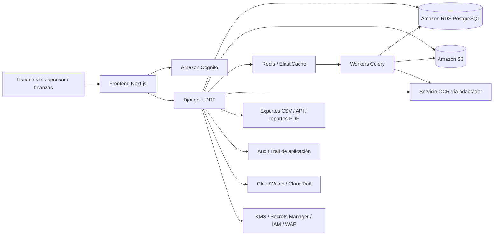
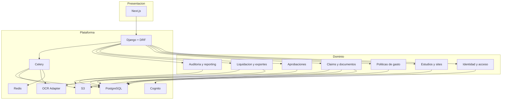
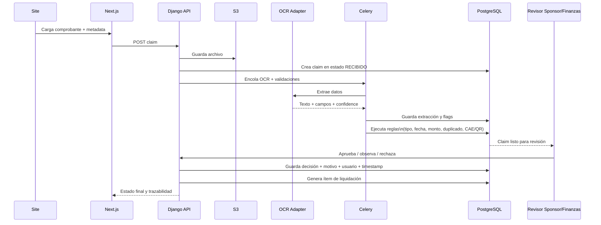
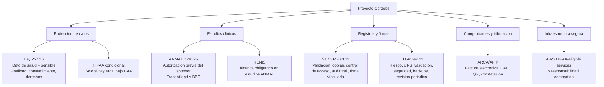
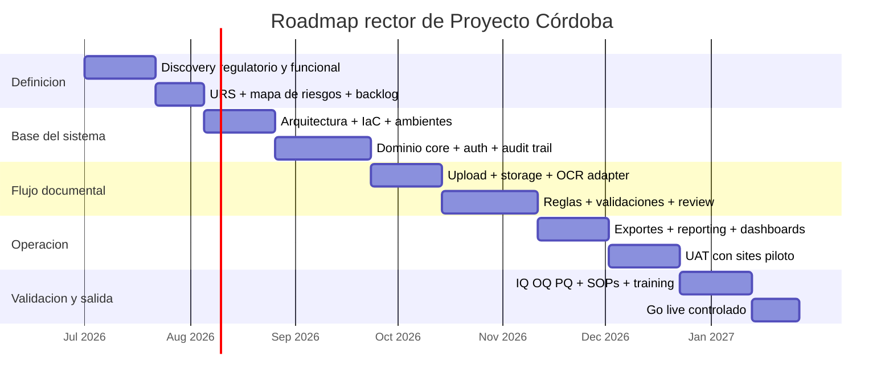

# Manual rector de Proyecto Córdoba

## Resumen ejecutivo

Este manual propone una única arquitectura rectora para **Proyecto Córdoba**: una plataforma web para **captura documental, validación, trazabilidad, liquidación y comunicación de reintegros/gastos vinculados a ensayos clínicos**, orientada a **sites** y **sponsors/CROs** en **Argentina**, diseñada desde el inicio para **extenderse a LATAM**. Esa interpretación surge del pedido funcional del proyecto, del foco en sites y sponsors, del énfasis en OCR, pagos, compliance y en comparables sectoriales como Suvoda/Greenphire, Scout Clinical, Medidata y nmible, todos ellos centrados en reembolsos, pagos y soporte operativo de estudios clínicos. citeturn1search8turn1search11turn35search0turn35search1turn35search2turn35search3

La recomendación es **descartar una arquitectura con backend NestJS + Prisma separado del frontend** y adoptar una **arquitectura principal de “monolito modular regulado”** con **Django + Django REST Framework + PostgreSQL**, frontend **Next.js** y una base infra **AWS** con servicios HIPAA-eligible cuando procesen o puedan llegar a procesar información sensible o ePHI. La razón no es ideológica: en un sistema regulado, con fuerte carga documental, trazabilidad, auditoría, autorizaciones finas, validación y SOPs, agregar un segundo backend y una segunda capa de modelos/validaciones aumenta el costo de validación, el perímetro operativo y la superficie de error sin una ganancia proporcional en la fase inicial. Django ofrece un enfoque “batteries included” con autenticación, admin, formularios, sesiones, logging, validaciones y checklist de despliegue; DRF agrega una capa madura de APIs; Next.js es útil como frontend moderno, pero no debe arrastrar al sistema a una doble lógica de negocio si el núcleo regulado ya vive en Django. Esto es una inferencia de ingeniería a partir del rol documentado de cada framework. citeturn6search3turn6search6turn6search12turn6search1turn27search2turn27search14turn5search2turn27search1turn32search0

En regulación, el punto más importante es este: **cualquier documento previo que siga referenciando la Disposición ANMAT 6677/10 como norma vigente central para estudios de farmacología clínica quedó desactualizado**. Esa disposición fue **abrogada por la Disposición 7516/2025**, vigente desde el **1 de diciembre de 2025**. El marco actual de referencia, a la fecha, para estudios de farmacología clínica con fines registrales en Argentina es el régimen aprobado por la **Disposición ANMAT 7516/25**. Además, el **RENIS** mantiene alcance obligatorio para estudios de farmacología clínica regulados por ANMAT. citeturn3search0turn3search3turn3search7turn3search10turn26search1turn26search12

Desde cumplimiento, la arquitectura debe asumir cuatro capas. La primera es **Argentina**: Ley **25.326** de protección de datos personales, donde la información de salud es **dato sensible**; consentimiento informado, finalidad, minimización, derechos de acceso/rectificación/supresión y seguridad de datos son relevantes para el diseño. La segunda es **ANMAT/RENIS** para cualquier uso en estudios regulados. La tercera es **AFIP/ARCA**, porque el sistema va a tocar comprobantes, CAE/QR, tipos documentales y eventualmente exportes tributarios o conciliaciones de respaldo. La cuarta es internacional y **condicional**: **HIPAA** si hay ePHI bajo covered entity/business associate; **21 CFR Part 11** si el sistema soporta registros electrónicos y firmas para procesos regulados FDA; **Annex 11** si el sistema respalda actividades reguladas del entorno europeo/GMP. HIPAA exige salvaguardas administrativas, físicas y técnicas para ePHI; Part 11 exige validez del sistema, copias legibles, control de acceso, audit trail y firma vinculada al registro; Annex 11 exige validación basada en riesgo, controles de seguridad, audit trail, backup y revisión periódica. citeturn21view0turn17search7turn17search3turn20view0turn17search12turn18view0turn19view0turn19view1turn19view2turn23search2turn24search1turn25search1turn25search16

La decisión táctica clave es **no integrar un motor de payouts global en la fase inicial**. El sistema debe nacer como **motor de intake, validación, reglas, documentación, liquidación, aprobación, exporte y evidencia**, no como wallet global. Las soluciones enterprise del mercado ofrecen pagos y reembolsos end-to-end, pero su adopción trae negociación contractual, BAA/DPA, tax handling, medios de pago por país, KYC/KYB, soporte, jurisdicción y dependencia de vendor. Para Argentina y LATAM, donde también hay sensibilidad tributaria y de soporte local, la fase inicial debe dejar el pago como **proceso asistido/off-platform** con integración futura por conector. Ese enfoque reduce riesgo regulatorio y acelera el time-to-value. citeturn35search0turn35search1turn35search2turn35search3turn35search5turn35search13turn25search1turn25search3

## Contexto y supuestos de trabajo

### Problema que resuelve el proyecto

El espacio funcional validado por las fuentes revisadas es claro: en estudios clínicos, los sponsors, CROs y sites necesitan reducir fricción administrativa alrededor de **reembolsos, estipendios, gastos de viaje y comprobantes**, porque esos flujos impactan en **reclutamiento, retención, cumplimiento operacional y confianza**. Los proveedores líderes del sector enfatizan tres beneficios recurrentes: visibilidad centralizada del estado de pagos/reembolsos, reducción de trabajo administrativo en sites y mejor experiencia del participante. citeturn1search8turn1search11turn1search16turn35search0turn35search1turn35search21

En Argentina, si el proyecto toca estudios de farmacología clínica con fines registrales, debe diseñarse sabiendo que el sponsor debe solicitar autorización previa ante ANMAT bajo la Disposición 7516/25 y que esos estudios tienen además alcance obligatorio en RENIS. ANMAT verifica exigencias científicas, éticas y regulatorias, exige habilitación de centros y profesionales, y mantiene instructivos específicos para autorización del estudio, seguridad, alta/baja de centros e investigadores. citeturn26search0turn26search1turn26search6turn26search8turn26search10turn26search12turn26search14

### Alcance recomendado

El alcance rector recomendado para el proyecto es el siguiente:

| Dominio | Dentro del alcance | Fuera del alcance inicial |
|---|---|---|
| Intake documental | carga de tickets, facturas, recibos, boarding passes, constancias, formularios y adjuntos | wallet del participante, app nativa compleja |
| OCR y clasificación | extracción de texto, datos tributarios, importes, fecha, emisor, CAE/QR, moneda, categoría de gasto | reconocimiento automático “sin revisión” en casos críticos |
| Reglas | políticas por estudio, sponsor, país, site, visita, tipo de gasto, topes, duplicados, estados | motor avanzado de fraude con scoring ML propio en fase inicial |
| Workflow | submit, revisión site, revisión financiera, aprobación/rechazo, observaciones, reenvío, cierre | dispersión internacional de pagos en tiempo real |
| Evidencia | audit trail, retención, reportes, exportes, trazabilidad, logs, paquetes para auditoría | reemplazo completo de CTMS/eTMF/ePRO |
| Integración | SSO, correo, export CSV/API, storage, OCR, facturación/validación documental | integración compleja bidireccional con todos los sistemas del sponsor en fase inicial |

La justificación de este alcance es regulatoria y operativa. ANMAT y marcos como Part 11/Annex 11 ponen foco en validación, trazabilidad, disponibilidad, data integrity y control de cambios. Entrar desde día uno en pagos globales multijurisdiccionales añade complejidad contractual y tributaria que no es necesaria para validar la utilidad del producto central. citeturn26search5turn20view0turn18view0turn19view1turn19view2

### Público objetivo

El sistema debe diseñarse para dos segmentos primarios y uno secundario:

| Segmento | Necesidad principal | Implicancia de diseño |
|---|---|---|
| Sites | cargar, revisar y seguir gastos sin depender de planillas ni mail | UX simple, estados claros, observaciones accionables, training corto |
| Sponsors/CROs | trazabilidad, control de política, reporting, compliance y auditoría | dashboards, exportes, políticas versionadas, logs, aprobación escalonada |
| Finanzas/ops internas | conciliación documental, legibilidad tributaria, evidencia defensiva | normalización de comprobantes, export bancario/ERP, retención documental |

Los vendedores líderes de este mercado presentan exactamente esos actores como usuarios centrales, con portales para sponsors, CROs, sites y participantes. citeturn1search8turn1search11turn1search20turn35search0turn35search5turn35search13

### Restricciones regulatorias y geográficas

Para Argentina, los datos de salud deben tratarse como **datos sensibles** bajo Ley 25.326; la ley define dato sensible incluyendo la información referente a la salud. Además, la ley exige consentimiento libre, expreso e informado como regla general del tratamiento, impone finalidad, calidad del dato y reconoce derechos del titular de acceso, rectificación y supresión. citeturn24search1turn23search2turn23search4

Para operación documental/tributaria local, ARCA mantiene el régimen de factura electrónica, CAE y QR de comprobantes, así como la constatación pública de comprobantes autorizados. Eso obliga a que el producto diferencie entre “comprobante cargado por usuario” y “comprobante validado tributariamente”. No es un detalle menor: ese estado debe quedar trazado en el modelo de datos y en los reportes. citeturn25search0turn25search1turn25search3turn25search7turn25search16

Fuera de Argentina, HIPAA, Part 11 y Annex 11 **no deben presentarse como universalmente obligatorios**. HIPAA aplica a ePHI en covered entities y business associates; Part 11 regula cuándo la FDA considera confiables los registros y firmas electrónicas en su ámbito; Annex 11 aplica a sistemas computarizados usados en actividades GMP reguladas en el marco europeo. En Proyecto Córdoba deben tratarse como **requisitos activables por estudio/cliente/jurisdicción**, no como lema comercial genérico. citeturn21view0turn20view0turn18view0

### Supuestos abiertos

Los siguientes elementos **no estaban especificados** en el material disponible y deben tratarse como abiertos, no como decisiones cerradas:

| Supuesto abierto | Estado recomendado |
|---|---|
| presupuesto total | abierto; no comprometer arquitectura multi-región o payouts globales sin definición |
| capacidad del equipo | abierto; asumir equipo pequeño-mediano con product owner, backend, frontend, QA, DevOps parcial, QA regulatorio |
| plazo contractual | abierto; roadmap propuesto en trimestres, no en fecha fija cerrada |
| integraciones obligatorias con CTMS/eTMF/ePRO | abierto; resolver por conectores posteriores |
| si habrá firma electrónica regulada en releases tempranos | abierto; diseñar preparado, activar después |
| si el sistema alojará ePHI real de sponsors US | abierto; si la respuesta es sí, cerrar BAA y activar controles HIPAA completos |
| si habrá dispersión de pagos desde la plataforma | abierto; se recomienda no hacerlo en fase inicial |

## Arquitectura rectora recomendada

### Decisión de arquitectura

La arquitectura recomendada es:

**Next.js como frontend web + Django monolítico modular como sistema de registro + PostgreSQL en RDS + S3 para documentos + Celery/Redis para jobs + OCR desacoplado vía adaptador + AWS como plataforma principal de cumplimiento.**

No es un monolito “rápido y sucio”. Es un **monolito modular regulado**, con fronteras internas claras por dominio: identidad, estudios, políticas, gastos, documentos, OCR, aprobaciones, contabilidad/exportes, auditoría y reporting.

La alternativa descartada es **Next.js + NestJS + Prisma** como doble backend lógico. Next.js ya es un framework full-stack; NestJS es otro framework server-side; Prisma agrega otra capa de abstracción y migraciones sobre la base. En un producto regulado, eso multiplica modelos, validaciones, adaptación de errores, permisos, secretos, pipelines y evidencia de testing. Django, en cambio, aporta ORM, auth, admin, forms, sessions, logging, seguridad y herramientas operativas integradas; DRF cubre la API; Celery resuelve tareas asíncronas. La reducción de complejidad no es estética: reduce costo de validación, SOPs, IQ/OQ/PQ y gestión de cambios. Esto es una inferencia de arquitectura sustentada en el rol documentado de los frameworks. citeturn27search2turn27search14turn5search2turn27search1turn6search3turn6search6turn6search12turn6search1turn6search2turn32search0

### Diagrama de componentes



La razón del componente “adaptador OCR” es estratégica. Permite iniciar con un proveedor principal y cambiarlo sin reescribir el dominio documental. Eso protege al proyecto frente a precisión variable por país, cambios de coste y requerimientos contractuales. AWS Textract extrae texto, formularios, tablas y gastos; Google Document AI ofrece una plataforma fuerte de comprensión documental y afirma soporte HIPAA bajo BAA; por eso ambos deben quedar detrás de una interfaz de proveedor, aunque la implementación inicial recomendada sea AWS-first. citeturn9search0turn9search12turn9search7turn8search3turn8search5

### Diagrama de dependencias



La separación interna más importante es entre **dominio** y **plataforma**. El error típico en este tipo de producto es incrustar lógica de política de gasto, tributación y aprobación dentro del frontend o de workers sin contrato claro. En Córdoba, todas las decisiones normativas y de negocio deben vivir en el dominio del backend, con versionado y trazabilidad. El frontend sólo orquesta interacción. Esa elección es coherente con Part 11 y Annex 11, que enfatizan validación, cambios controlados y auditabilidad. citeturn20view0turn18view0turn19view1turn19view2

### Flujo de datos



El flujo correcto no es “subida -> OCR -> pago”. Debe ser **subida -> persistencia inmutable del original -> extracción -> reglas -> revisión humana según riesgo -> decisión -> liquidación/exporte**. Ese orden existe para cumplir con integridad de dato, evidencia auditiva y posibilidad de reanálisis o reinspección. Annex 11 exige backups, audit trails y revisión; Part 11 exige copias exactas, validación y audit trail. citeturn20view0turn18view0turn19view1turn19view2

### Mapa de cumplimiento



### Matriz de cumplimiento operativo

| Marco | Qué exige para Córdoba | Implementación rectora |
|---|---|---|
| Ley 25.326 | dato de salud sensible; finalidad; consentimiento; calidad; derechos del titular | minimización de datos, consentimiento/versionado, matriz de permisos, política de retención, export/delete workflow citeturn24search1turn23search2turn23search4 |
| ANMAT 7516/25 | autorización previa de estudios alcanzados; trazabilidad; BPC; fiscalización | modelo por estudio y sponsor, expediente y documentación versionada, centros/sites habilitados, reportes exportables para auditoría citeturn26search0turn26search5turn26search8turn26search12 |
| RENIS | obligatoriedad en estudios de farmacología clínica ANMAT | campo de registro RENIS/referencia de estudio, consistencia de metadatos, reporte de dataset mínimo citeturn26search1 |
| HIPAA | salvaguardas administrativas, físicas y técnicas para ePHI; sólo con BAA | cuenta HIPAA, BAA, cifrado, logging, IAM, segregación por ambiente, mínimo necesario; activar sólo si el cliente lo requiere citeturn21view0turn4search0turn36view0 |
| 21 CFR Part 11 | validación, copias legibles/ electrónicas, acceso autorizado, audit trail, manifestación y vínculo de firma | VMP, URS/FS/DS, audit trail inmutable, print/export legible, firma electrónica posterior, control de acceso por rol citeturn20view0 |
| Annex 11 | gestión por riesgo, URS, supplier assessment, backup, security, audit trail, revisión periódica | risk register, evaluación de vendor, OQ/PQ, SOP de backup/restore, revisión periódica anual, incident CAPA citeturn18view0turn19view0turn19view1turn19view2 |
| AFIP/ARCA | comprobantes electrónicos, CAE, QR, constatación pública | extractor de metadatos tributarios, validador de CAE/QR, estado “verificado/no verificado”, archivo de evidencia citeturn25search0turn25search1turn25search16 |

## Ejecución, gobernanza y validación

### Metodología

La metodología correcta no es “ágil pura” ni “validación al final”. Debe ser una **metodología híbrida**:

- **discovery corto** para cerrar reglas reales del sponsor/site;
- **delivery incremental** por módulos de riesgo acotado;
- **validación continua** sobre requisitos y evidencias;
- **change control** desde la primera release relevante.

La base regulatoria de esa elección es directa: Annex 11 exige validación basada en riesgo durante el ciclo de vida del sistema; Part 11 exige validación del sistema para asegurar exactitud, confiabilidad, desempeño consistente y capacidad de discernir registros alterados o inválidos. citeturn18view0turn19view0turn20view0

### Gobernanza mínima obligatoria

| Rol | Responsabilidad principal | Evidencia |
|---|---|---|
| Product Owner | prioriza necesidades y firma alcance funcional | backlog aprobado, decisiones de alcance |
| System Owner | responsable del sistema en operación | inventario de sistemas, revisión periódica |
| Process Owner | define reglas operativas y de negocio | política de gastos, matriz de decisión |
| QA de software | asegura calidad de testing y liberación | plan de pruebas, evidencias CI |
| QA regulatorio | controla validación, change control, CAPA, trazabilidad documental | VMP, URS, RTM, IQ/OQ/PQ, SOPs |
| Security/DevOps | IAM, secretos, backup, logging, hardening, monitoreo | baseline, runbooks, reportes de control |
| Sponsor/site leads | UAT y aceptación operativa | actas de UAT y criterios firmados |

Annex 11 menciona explícitamente cooperación entre Process Owner, System Owner, Qualified Persons e IT, y exige acuerdos formales con terceros y evaluación apropiada de proveedores. citeturn18view0

### Validación y QA

La validación recomendada para Córdoba debe producir al menos este paquete:

| Documento / artefacto | Objetivo | Momento |
|---|---|---|
| VMP | estrategia general de validación | inicio del proyecto |
| URS | requisitos de usuario trazables | antes del build detallado |
| FS/DS | especificación funcional y de diseño | por módulo |
| Risk Assessment | clasificar criticidad y controles | por release y por cambio mayor |
| RTM | matriz requisito-prueba-evidencia | continua |
| IQ/OQ/PQ | instalación, operación, desempeño | antes de go-live regulado |
| Test Evidence | unit, integration, E2E, seguridad, UAT | continua |
| Change Control Record | documentar cambios, impacto y aprobación | cada cambio controlado |
| Periodic Review | confirmar estado válido continuo | anual o por política |

Part 11 y Annex 11 convergen en los puntos duros: validación, control de acceso, copias legibles, audit trail, cambio controlado y revisión periódica. citeturn20view0turn19view0turn19view1turn19view2

### Criterios de calidad no negociables

Los criterios rectores deben ser:

| Área | Criterio |
|---|---|
| Integridad documental | el archivo original nunca se sobreescribe |
| Auditabilidad | toda acción relevante registra quién, qué, cuándo, desde dónde y por qué |
| Reproducibilidad | cada decisión de aprobación/rechazo es explicable desde reglas y evidencia |
| Recuperación | restore probado de base y documentos |
| Seguridad | MFA para perfiles privilegiados; least privilege; secretos fuera del código |
| Trazabilidad | cada claim está ligado a estudio, site, sponsor, política y versión de reglas |
| Operabilidad | dashboards, alertas y logs útiles, no solo infraestructura |
| Usabilidad | el site puede cargar y resolver observaciones sin soporte constante |

AWS señala que, aun usando servicios HIPAA-eligible, el cliente sigue siendo responsable de configurar los controles correctamente bajo el modelo de responsabilidad compartida. citeturn4search0turn36view0

## Herramientas seleccionadas

### Tabla comparativa

| Categoría | Herramienta recomendada | Rol | Justificación | Alternativas consideradas | Coste estimado | BAA-eligible / compliance | Fuente oficial |
|---|---|---|---|---|---|---|---|
| Backend | **Django** | núcleo del sistema de registro | framework con ORM, auth, sesiones, forms, admin, logging y enfoque batteries-included; reduce superficie de validación frente a doble backend | NestJS + Prisma; FastAPI | open source | depende de la infraestructura, no del framework | citeturn6search3turn6search6turn32search12 |
| API | **Django REST Framework** | APIs para frontend e integraciones | toolkit maduro para APIs Django, consistente con el dominio centralizado | GraphQL/AppSync; FastAPI | open source | n/a | citeturn6search1turn6search13 |
| Frontend | **Next.js** | interfaz web para sites y sponsors | framework React moderno, útil para paneles, formularios y despliegue productivo | React puro; Remix | open source; hosting según infra | n/a | citeturn5search9turn5search13turn27search2 |
| Jobs asíncronos | **Celery** | OCR, validaciones, reportes, notificaciones | cola flexible y madura para Python; encaja con Django | AWS Step Functions; SQS consumers propios | open source | n/a | citeturn6search2turn6search8 |
| Cache / broker | **Amazon ElastiCache Redis** | broker y cache | Redis es estándar operativo; ElastiCache evita administración manual | Redis autogestionado; Valkey | pago por uso | **sí**, figura como HIPAA-eligible | citeturn29search6turn12search2turn36view0 |
| Base de datos | **Amazon RDS for PostgreSQL** | sistema de registro transaccional | PostgreSQL es robusto y RDS simplifica backups, HA, cifrado y administración | Aurora PostgreSQL; PostgreSQL self-hosted | pago por uso; calculadora oficial | **sí**, RDS figura como HIPAA-eligible | citeturn29search3turn12search0turn12search5turn36view0 |
| Storage documental | **Amazon S3** | objetos, adjuntos, evidencia, exportes | storage estándar, versionable, integrable con lifecycle y backups | MinIO; EFS | pago por uso, sin mínimo | **sí**, S3 figura como HIPAA-eligible | citeturn12search1turn36view0 |
| Infra de contenedores | **Amazon ECS on Fargate** | ejecución de web/worker | servicio administrado de contenedores, menor carga operativa que Kubernetes | EKS; Railway Enterprise | pago por vCPU/GB-h | **sí**, ECS y Fargate figuran como HIPAA-eligible | citeturn13search1turn13search2turn13search6turn13search0turn36view0 |
| Registro de imágenes | **Amazon ECR** | almacenamiento de imágenes Docker | registry administrado, integrado con ECS e IAM | GHCR; Docker Hub | pago por almacenamiento/transferencia | **sí**, ECR figura como HIPAA-eligible | citeturn16search2turn16search3turn16search9turn36view0 |
| Autenticación | **Amazon Cognito** | identidad, OIDC/OAuth2, MFA, SSO | evita construir auth propio y está alineado con AWS | Auth0; Keycloak | pago por uso, sin mínimos | **sí**, Cognito figura como HIPAA-eligible y BAA-eligible | citeturn14search0turn14search1turn14search3turn4search3turn36view0 |
| OCR inicial | **Amazon Textract** | extracción de texto, formularios, tablas y gastos | mantener AWS-first simplifica BAA, networking y evidencias; admite forms/tables/expense | Google Document AI; Veryfi | pago por página | **sí**, Textract figura como HIPAA-eligible | citeturn9search0turn9search1turn9search7turn9search12turn7search1turn36view0 |
| OCR alternativo | **Google Document AI** | alternativa de mayor especialización documental | buena opción detrás del adaptador si la precisión lo justifica; Google indica HIPAA con BAA y no uso de datos para entrenar modelos | Textract; Veryfi | pago por uso/procesador | HIPAA bajo BAA de Google Cloud | citeturn8search0turn8search3turn8search4turn7search0turn7search10 |
| Pagos en fase inicial | **Sin motor de payout integrado** | liquidación y evidencia, no dispersión | reduce riesgo contractual, fiscal y operativo; primero capturar, validar y exportar | nmible, Greenphire Patient Payments, Scout Clinical, Medidata Patient Payments | n/a inicial | depende del partner futuro | citeturn35search0turn35search1turn35search2turn35search3turn25search1 |
| CI/CD | **GitHub Actions** | pipelines de test, build y deploy | suficiente para equipo pequeño-mediano; runners autohospedados permiten aislar releases | AWS CodePipeline/CodeBuild | minutos incluidos + extra; self-hosted sin cargo por Actions | no tratar datos sensibles en runners SaaS; preferir self-hosted para release regulado | citeturn10search0turn10search3turn10search14 |
| Monitoreo | **CloudWatch + CloudTrail** | observabilidad, métricas, logs y eventos auditables de AWS | unifica monitoreo de plataforma y eventos de control; CloudTrail guarda actividad audit-worthy | Datadog; New Relic; Sentry complementario | pago por uso | **sí**, ambos figuran como HIPAA-eligible | citeturn11search0turn11search4turn11search5turn36view0 |
| Error tracking app | **Sentry** | errores de aplicación y trazas | útil como complemento app-level, pero no como repositorio de datos sensibles | solo CloudWatch; Rollbar | free/Business trial | tratar payloads con scrubbing estricto | citeturn10search2 |
| Secretos | **AWS Secrets Manager** | secretos y rotación | evita credenciales hardcoded y registra eventos | SSM Parameter Store; Vault | por secreto + API calls | **sí**, figura como HIPAA-eligible | citeturn16search0turn16search1turn16search4turn36view0 |
| Cifrado | **AWS KMS** | llaves y cifrado | estándar operacional en AWS; integra con S3/RDS/Secrets | CloudHSM; claves externas | desde **USD 1/mes por clave** + uso | **sí**, ACM/KMS ecosystem en AWS; KMS en pricing oficial | citeturn13search3turn36view0 |
| Seguridad perimetral | **AWS WAF + ALB + ACM + Route 53** | exposición segura, TLS, balanceo y DNS | stack perimetral nativo y auditado | Cloudflare; NGINX self-hosted | WAF por ACL/reglas/requests; ALB y Route53 por uso; ACM gestionado | WAF, ELB y Route53 figuran como HIPAA-eligible; ACM también | citeturn14search2turn15search0turn15search3turn33search0turn33search6turn36view0 |
| Backups | **AWS Backup** | política central de backups y restore | centraliza estrategia de backup y evidencia | snapshots sueltos; scripts ad hoc | pago por uso | en combinación con servicios AWS; útil para compliance | citeturn37search1turn37search5turn37search14 |

### Decisiones de descarte relevantes

**Railway Enterprise** mejoró su postura de compliance y hoy comunica SOC 2 Type II, SOC 3 e HIPAA en enterprise. Aun así, para Córdoba **no** es la opción rectora por tres razones. La primera es **gobernanza regulatoria**: AWS expone una referencia formal y granular de servicios HIPAA-eligible que permite mapear arquitectura por componente. La segunda es **amplitud operativa**: IAM, Cognito, CloudTrail, RDS, S3, ECS, Textract, Backup, KMS, Secrets Manager y otras piezas críticas quedan en un solo plano operacional. La tercera es **evidencia de validación**: un stack más explícito, con primitives bien delimitadas, simplifica IQ/OQ/PQ y auditoría. citeturn5search0turn5search11turn5search15turn36view0

**MinIO/AIStor** tampoco es la opción principal. Es S3-compatible y técnicamente potente, pero su orientación actual está fuertemente posicionada en AI data infrastructure y despliegues licenciados de producción. Para Córdoba, S3 tiene menor fricción, mejor integración nativa con el resto del stack y una postura de compliance directamente mapeable. citeturn34search0turn34search1turn34search5turn34search10turn12search1

## Roadmap y entregables

### Roadmap rector



El timeline es deliberadamente **por etapas de evidencia**, no por features sueltas. La liberación correcta en un entorno con Part 11/Annex 11 potenciales no es “cuando termina de funcionar”, sino cuando además existe trazabilidad, testing, backup/restore probado, SOPs mínimas y criterios de aceptación firmados. citeturn20view0turn19view1turn19view2

### Entregables por etapa

| Etapa | Entregables | Criterio de aceptación |
|---|---|---|
| Discovery | Project charter, mapa de actores, alcance, URS v1, risk register inicial | sponsor y process owner aprueban alcance y supuestos |
| Arquitectura | ADRs, diagramas, repos, IaC, ambientes dev/test, baseline seguridad | ambientes reproducibles y checklist de seguridad ejecutado |
| Core | auth, RBAC, estudios, sites, claims, documentos, audit trail | flujos CRUD trazados, permisos validados, logs consistentes |
| OCR y reglas | adaptador OCR, extracción, validaciones, estados, duplicados, CAE/QR | claims pasan de recibido a revisable con evidencia y motivos |
| Reporting | dashboards sponsor/site, export CSV/API, paquete PDF de auditoría | métricas y exportes coinciden con datos de sistema |
| UAT | scripts UAT, defect log, training materials | sites piloto completan casos sin bloqueo mayor |
| Validación | VMP, RTM, IQ/OQ/PQ, SOPs, CAPA, release record | QA regulatorio firma aptitud para go-live |
| Go-live | cutover plan, runbooks, soporte hiper-care | restore probado, monitoreo activo, incident path definido |

### Plantillas y formatos obligatorios

| Plantilla / formato | Contenido mínimo |
|---|---|
| SOP de carga documental | tipos permitidos, naming, criterios de rechazo, tamaño, legibilidad |
| SOP de revisión | reglas de aprobación, observaciones, evidencia faltante, SLA |
| SOP de backup/restore | frecuencia, responsables, prueba periódica, evidencia |
| SOP de change control | clasificación, impacto, aprobación, rollback |
| Log de incidentes | severidad, root cause, CAPA, cierre |
| Reporte de claim | estudio, site, participante pseudonimizado, gasto, documento, estado, decisión |
| Bitácora de auditoría | actor, acción, timestamp, objeto afectado, motivo |
| PDF de paquete de revisión | resumen ejecutivo, documentos, extracción OCR, reglas disparadas, decisión |
| Reporte mensual sponsor | claims recibidos/aprobados/rechazados/tiempos/SLA/topes |
| Checklist de site | readiness técnica, usuarios, conexión, entrenamiento, pruebas |

## Prompts operativos para Codex o Claude Code

### Prompt para fase de arquitectura

```text
Contexto:
Estás construyendo Proyecto Córdoba, una plataforma regulada para gestión de claims de gastos y reembolsos en ensayos clínicos para sites y sponsors en Argentina/LATAM. La arquitectura rectora es Next.js frontend + Django/DRF backend + PostgreSQL + S3 + Celery/Redis + OCR adapter. El sistema debe priorizar audit trail, control de acceso, trazabilidad y validación.

Inputs esperados:
- Documento URS en Markdown
- Lista de entidades de dominio
- Roles de usuario
- Reglas regulatorias activas/inactivas por jurisdicción

Outputs esperados:
- Propuesta de estructura de repositorio
- Lista de apps/modules Django
- Modelo de datos inicial
- ADR técnico con decisiones y trade-offs
- Checklist de riesgos técnicos

Criterios de aceptación:
- Ninguna regla de negocio queda en el frontend si impacta decisión regulada
- Existe una app/module explícita para audit trail
- Existe versionado de policies de gasto
- El diseño soporta exportes legibles y retención documental
- La propuesta distingue claramente PII/ePHI de metadatos operativos

Tests automatizados sugeridos:
- tests de importación de módulos
- tests de migraciones
- tests de permisos base por rol
- test de creación de claim con audit trail
- test de serialización/exporte legible
```

### Prompt para fase de dominio core

```text
Contexto:
Implementa el dominio core de Proyecto Córdoba en Django. Entidades mínimas: Sponsor, Study, Site, UserProfile, ExpensePolicy, Claim, ClaimDocument, ReviewDecision, AuditEvent. El sistema debe ser trazable y orientado a revisión humana según riesgo.

Inputs esperados:
- Esquema de entidades
- Matriz de roles
- Flujos de estados permitidos

Outputs esperados:
- modelos Django
- migraciones
- admin seguro
- serializers DRF
- endpoints CRUD mínimos
- state machine documentada

Criterios de aceptación:
- Todos los cambios de estado generan AuditEvent
- Los documentos originales no se modifican ni reemplazan
- Los usuarios solo ven claims de su scope
- Las decisiones de revisión guardan motivo, actor y timestamp
- Las policies se pueden versionar sin romper historial

Tests automatizados sugeridos:
- pytest de transición de estados
- pytest de aislamiento por sponsor/site
- pytest de integridad referencial
- pytest de borrado protegido
- snapshot tests de serializers
```

### Prompt para fase de intake documental y OCR

```text
Contexto:
Construye el flujo de upload documental y OCR adapter para Proyecto Córdoba. Debe soportar PDF e imágenes, persistir original en S3, disparar job asíncrono, guardar resultado OCR, confidence y flags de revisión.

Inputs esperados:
- lista de MIME types aceptados
- bucket/prefix por ambiente
- contrato del OCR adapter
- reglas de validación documental

Outputs esperados:
- endpoint de upload
- servicio de storage
- contrato abstracto OCRProvider
- implementación inicial Textract
- tabla de OCRExtraction
- flags: low_confidence, duplicate_candidate, tax_validation_pending

Criterios de aceptación:
- el endpoint nunca procesa OCR síncronamente
- el sistema guarda hash del archivo para detectar duplicados
- los errores de OCR no rompen el claim
- se conserva el original y también el resultado estructurado
- todo evento produce trazabilidad operativa

Tests automatizados sugeridos:
- archivo válido / inválido
- job en cola correcto
- mock del OCR provider
- detección de duplicado por hash
- retry idempotente
```

### Prompt para fase de reglas y revisión

```text
Contexto:
Implementa motor de reglas declarativas para Proyecto Córdoba. Debe evaluar topes, fechas, tipos de gasto permitidos, moneda, duplicados, campos tributarios y política por estudio. El motor no debe aprobar pagos automáticamente de forma irreversible.

Inputs esperados:
- YAML/JSON de policy por estudio
- catálogo de tipos de gasto
- reglas de severidad y observación

Outputs esperados:
- evaluador de reglas
- estructura de RuleResult
- lista de flags y severidades
- pantalla/API de revisión humana
- historial de versiones de policy

Criterios de aceptación:
- la salida es explicable claim por claim
- las políticas versionadas mantienen distancia histórica
- el reviewer ve qué regla disparó cada flag
- existe modo simulación para policy nueva
- no se altera el documento original ni la extracción original

Tests automatizados sugeridos:
- parametrización de reglas
- snapshot de explicación de decisión
- policy simulation test
- regressions sobre claims históricos
```

### Prompt para fase de reporting y auditoría

```text
Contexto:
Construye reporting operativo y paquete de auditoría para Proyecto Córdoba. Debe servir a sponsors, sites y QA regulatorio. El reporte debe ser legible y exportable.

Inputs esperados:
- métricas objetivo
- layouts de reporte
- campos obligatorios de auditoría

Outputs esperados:
- dashboard sponsor
- dashboard site
- export CSV
- paquete PDF de claim
- timeline de eventos por claim

Criterios de aceptación:
- sponsor ve SLA, tasas de aprobación/rechazo y backlog
- site ve sus claims y observaciones accionables
- el paquete PDF incluye documento, extracción, flags y decisión
- la numeración/versionado de reportes es consistente
- el export es reproducible contra base

Tests automatizados sugeridos:
- fixture con claims multiestado
- validación de agregados
- snapshot PDF/HTML
- test de autorización por rol
```

### Prompt para fase de validación regulatoria

```text
Contexto:
Prepara el paquete de validación de Proyecto Córdoba para un go-live controlado. El sistema puede operar con requisitos Part 11/Annex 11 activables por cliente/estudio.

Inputs esperados:
- URS final
- matriz de pruebas
- arquitectura aprobada
- inventario de sistemas y proveedores

Outputs esperados:
- VMP
- RTM
- IQ/OQ/PQ drafts
- checklist de release regulada
- SOP pack mínimo

Criterios de aceptación:
- cada requisito crítico tiene evidencia trazable
- existen pruebas de backup/restore y control de acceso
- los cambios abiertos están clasificados por riesgo
- los third parties tienen evaluación documentada
- la release tiene acta de aprobación

Tests automatizados sugeridos:
- ejecución CI green obligatoria
- coverage gates en módulos críticos
- reporte de dependencias
- smoke tests post-deploy
- test de restauración en ambiente de validación
```

## Operación en sites y anexos útiles

### Plantilla de comunicación a sites

**Asunto:** Inicio de onboarding a Proyecto Córdoba

**Cuerpo sugerido**

> Estimado equipo del site,  
>  
> Estamos iniciando el uso de Proyecto Córdoba para la gestión y seguimiento de gastos/comprobantes asociados al estudio **[Nombre del estudio]**. El objetivo es centralizar la carga documental, acelerar la revisión y mejorar la trazabilidad operativa.  
>  
> Qué cambia para el site:  
> - la carga de comprobantes se realizará en la plataforma;  
> - cada claim tendrá estado visible y observaciones trazables;  
> - los documentos quedarán asociados al estudio y al circuito de revisión;  
> - cualquier requerimiento adicional quedará registrado en el sistema.  
>  
> Qué necesitamos del site antes del inicio:  
> - designación de usuarios;  
> - validación de accesos;  
> - prueba de carga de documentos;  
> - confirmación de entrenamiento completado.  
>  
> Fecha de activación prevista: **[fecha]**.  
> Canal de soporte: **[mail / canal]**.  
>  
> Saludos,  
> **[equipo / sponsor / CRO]**

### FAQ para sites

| Pregunta | Respuesta rectora |
|---|---|
| ¿Qué documentos puedo subir? | PDF, JPG, PNG y formatos definidos por política del estudio. |
| ¿El documento cargado puede modificarse? | No. El original queda preservado; cualquier revisión queda registrada como metadato o nueva carga. |
| ¿Qué pasa si el OCR lee mal? | El OCR asiste; no sustituye revisión humana cuando hay flags o baja confianza. |
| ¿Cómo sé si un claim fue observado? | El sistema debe exponer estado, motivo y acción requerida. |
| ¿Qué pasa con una factura inválida? | Debe distinguirse entre documento cargado y documento tributariamente verificado; la plataforma no debe “suponer” validez. |
| ¿Puedo ver claims de otro site? | No, salvo permisos explícitos del sponsor/administrador. |
| ¿Qué pasa si el sistema no está disponible? | Debe existir plan documentado de continuidad y reingreso posterior. |

### Checklist de readiness para sites

| Control | Resultado esperado |
|---|---|
| Usuario principal creado | sí |
| Usuario de respaldo creado | sí |
| MFA operativo | sí para perfiles de revisión/administración |
| Acceso desde red del site | probado |
| Carga de PDF y foto | probada |
| Visualización de observaciones | probada |
| Export simple / descarga de comprobante | probada |
| Entrenamiento básico completado | sí |
| Procedimiento de contingencia conocido | sí |
| Contacto de soporte identificado | sí |

### Hallazgos adicionales útiles

El hallazgo más relevante para “revisar las fuentes” es que el marco ANMAT cambió. **Si en documentación previa del proyecto aparecen 6677/10 como norma vigente central, debe corregirse a 7516/25** y debe actualizarse cualquier matriz regulatoria o de requisitos con entrada en vigor de diciembre de 2025. citeturn3search0turn3search7turn3search10

También conviene separar dos decisiones que suelen mezclarse mal. La primera es **plataforma de workflow documental y compliance**. La segunda es **vendor de pagos globales**. Suvoda/Greenphire, Scout Clinical, Medidata y nmible muestran que el mercado resolvió ambas capas, pero no obliga a Córdoba a comprarlas juntas desde el día uno. Si el problema actual es caos operativo y falta de trazabilidad, Córdoba puede capturar valor antes de resolver la última milla de la dispersión. citeturn35search0turn35search1turn35search2turn35search3turn35search13turn35search20

### Extractos normativos clave

| Norma | Extracto útil para diseño |
|---|---|
| Ley 25.326 | la información referente a la salud integra la categoría de datos sensibles; el tratamiento exige principios de finalidad, calidad y consentimiento, con derechos de acceso, rectificación y supresión citeturn24search1turn23search2turn23search4 |
| HIPAA Security Rule | exige salvaguardas administrativas, físicas y técnicas para asegurar confidencialidad, integridad y disponibilidad de ePHI citeturn21view0 |
| 21 CFR Part 11 | exige validación, copias exactas y completas, acceso autorizado, audit trail seguro y firma vinculada al registro citeturn20view0 |
| Annex 11 | exige validación basada en riesgo, URS trazable, seguridad, backup/restore, audit trail y revisión periódica del sistema citeturn18view0turn19view0turn19view1turn19view2 |
| ANMAT 7516/25 | sponsors deben pedir autorización previa a ANMAT para estudios alcanzados; foco en seguridad, trazabilidad y desarrollo ético/técnico/científico citeturn26search5turn26search12 |
| RENIS | alcance obligatorio para estudios de farmacología clínica regulados por ANMAT citeturn26search1 |
| ARCA/AFIP | el sistema de factura electrónica, CAE, QR y constatación pública obliga a preservar evidencia tributaria separada del mero upload del usuario citeturn25search0turn25search1turn25search16 |

### Fuentes oficiales y primarias revisadas

La base normativa y técnica de este manual proviene, principalmente, de: ANMAT/Argentina.gob.ar sobre investigaciones clínicas y Disposición 7516/25; RENIS; Ley 25.326 en InfoLEG/Argentina.gob.ar; ARCA/AFIP sobre facturación electrónica, QR y constatación; HHS sobre HIPAA; eCFR sobre Part 11; Comisión Europea/EudraLex Annex 11; documentación oficial de Django, DRF, Celery, Next.js, AWS, Google Cloud, GitHub y OWASP. citeturn26search0turn26search1turn26search8turn23search2turn24search1turn25search1turn25search16turn21view0turn20view0turn18view0turn19view0turn19view1turn19view2turn6search0turn6search1turn6search2turn27search2turn36view0turn8search3turn10search3turn32search1

### Preguntas abiertas y limitaciones

Este manual no contó con un **project charter interno**, contratos, presupuesto, matriz real de sponsors, CTMS objetivo ni política fiscal del flujo de pagos. Por eso varias decisiones quedan explícitamente como **supuestos abiertos**. La arquitectura propuesta es sólida como manual rector técnico-regulatorio, pero antes de firmar alcance final deberían cerrarse cuatro decisiones: si habrá ePHI real bajo BAA, si habrá firma electrónica regulada temprana, si el pago se hará dentro o fuera de la plataforma y qué integraciones externas son verdaderamente obligatorias en la primera release.